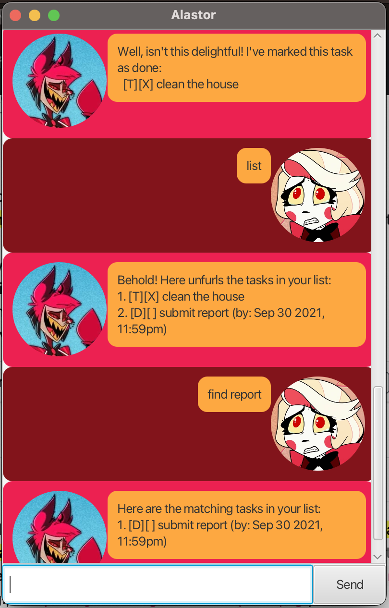

# Alastor User Guide



Introducing Alastor, your Personal Assistant Chatbot inspired by Hazbin Hotel. Let this charming companion help you keep track of everything in life with a touch of devilish wit!

## Adding todos: `todo`
To add a todo task (task without any date/time attached to it) to the task list.

Format: `todo <description>`

Example: `todo clean the house`
```
Marvelous! Another task graces our repertoire:
  [T][ ] clean the house
And with this latest addition, our list of tasks swells to a delightful 1.
```

## Adding deadlines: `deadline`
To add deadline task (tasks that need to be done before a specific date/time) to the task list.

Format: `deadline <description> /by <date>`
- Date format: `dd-MM-yyyy HH:mm`

Example: `deadline submit report /by 30-09-2021 23:59`
```
Marvelous! Another task graces our repertoire:
  [D][ ] submit report (by: Sep 30 2021, 11:59pm)
And with this latest addition, our list of tasks swells to a delightful 2.
```

## Adding events: `event`
To add an event task (tasks that start at a specific date/time and ends at a specific date/time) to the task list.
 
Format: `event <description> /from <start date> /to <end date>`
- Date format: `dd-MM-yyyy HH:mm`
- start date should be before end date

Example: `event attend a party /from 31-12-2021 18:00 /to 01-01-2022 02:00`
```
Marvelous! Another task graces our repertoire:
  [E][ ] attend a party (from: 31 Dec 2021, 06:00pm, to: 01 Jan 2022, 02:00am)
And with this latest addition, our list of tasks swells to a delightful 3.
```

## Listing all tasks: `list`
To list all tasks in the task list.

Format: `list`
- Returns an empty list if there are no tasks.
```
Behold! Here unfurls the tasks in your list:
1. [T][ ] clean the house
2. [D][ ] submit report (by: Sep 30 2021, 11:59pm)
3. [E][ ] attend a party (from: 31 Dec 2021, 06:00pm, to: 01 Jan 2022, 02:00am)
```

## Marking tasks: `mark` and `unmark`
To mark a task as done in the task list.

Format: `mark <index>`
- index refers to the index number shown in the task list.

Example: `mark 2`
```
Well isnt this delightful! I've marked this task as done:
  [D][X] submit report (by: Sep 30 2021, 11:59pm)
```
To unmark a task as not done in the task list, you can use `unmark` in the same way.

Example: `unmark 2`
```
Very well! I've noted this task as yet untouched:
  [D][ ] submit report (by: Sep 30 2021, 11:59pm)
```

## Deleting tasks: `delete`
To delete a task from the task list.  

Format: `delete <index>`
- index refers to the index number shown in the task list.

Example: `delete 3`
```
Very well! I've removed this task from our list:
  [E][ ] attend a party (from: 31 Dec 2021, 06:00pm, to: 01 Jan 2022, 02:00am)
```

## Finding tasks: `find`
To find tasks whose descriptions contain the given keyword.

Format: `find <keyword>`
- The keyword can be a partial word or a full word.

Example: `find report`
```
Here are the matching tasks in your list:
1. [D][ ] submit report (by: Sep 30 2021, 11:59pm)
```

## Getting help: `help`
To display the list of commands and their formats.

Format: `help`
```
Here are the commands you can use:
1. todo <description> - Adds a todo task to the list.
2. deadline <description> /by <date> - Adds a deadline task to the list.
3. event <description> /from <date> /to <date>  - Adds an event task to the list.
4. list - Lists all the tasks in the list.
5. mark <index> - Marks the task at the specified index as done.
6. unmark <index> - Marks the task at the specified index as undone.
8. delete <index> - Deletes the task at the specified index.
9. find <keyword> - Finds tasks that match the keyword.
10. help - Shows the list of commands.
11. bye - Exits the program.
```

## Exiting the program: `bye`
To exit the program.

Format: `bye`
- Closes the program after a short farewell message.
```
Farewell! Should you ever require my services again, simply summon me.
```


